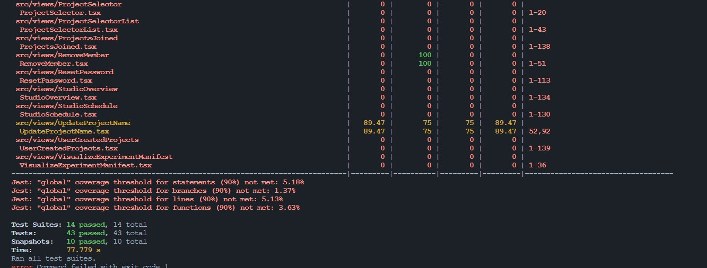

This page aimed for LitmusChaos contributors to write efficient test codes.

# Backend
## Unit Testing
Unit tests are functions that test specific pieces of code from a program or package. The primary objective of unit tests is to check the correctness of an application, leading to better software that is more robust, has fewer bugs, and is more stable. Before starting, We highly recommend [watching this video](https://youtu.be/8hQG7QlcLBk).

### Naming Convention
According to the [Golang testing package](https://go.dev/doc/tutorial/add-a-test), we follow [these naming conventions](https://pkg.go.dev/testing#pkg-overview).

```go
func helloWorld() {} // target function
func TestHelloWorld() {} // test function

type FooStruct struct {}
func (f *FooStruct) Bar() {} // target method
func TestFooStruct_Bar(){} // test function
```

### Testing Structure
A good structure for all unit tests follows these,

1. Set up the test data
2. Call your method under the test
3. Assert that the expected results are returned

These three steps are replaced with [“given”, “when”, “then” in BDD](https://martinfowler.com/bliki/GivenWhenThen.html). You can make unit test codes easier if you adopt this pattern.

```go
// example of given-when-then pattern
func TestChaosHubService_DeleteChaosHub(t *testing.T) {
  t.Run("success", func(t *testing.T) {
     // given
     findResult := bson.D{
        {"project_id", "1"},
        {"hub_name", "hub1"},
        {"hub_id", "1"},
     }

     // when
     _, err := mockService.DeleteChaosHub(context.Background(), "1", "1")

     // then
     assert.NoError(t, err)
  })
}
```
### What to test?
Tests that are too close to the production code are not recommended. As soon as you fix your production code, You need to change the test code too(the test code will be broken)! You rather test for observable behavior. Here’s what [Martin Fowler’s Blog](https://martinfowler.com/articles/practical-test-pyramid.html) suggests.

> Think about
if I enter values x and y, will the result be z?
instead of
If I enter x and y, will the method call class A first, then call class B and then return the result of class A plus the result of class B?

We can accomplish this by subtests in the [Golang testing package](https://pkg.go.dev/testing#hdr-Subtests_and_Sub_benchmarks). We don’t have to write separate functions. Instead, use `t.Run()` so that we can verify the result by various inputs in one function.

```go
// example of subtests
func TestChaosHubService_UpdateChaosHub(t *testing.T) {
  t.Run("cannot find same project_id hub", func(t *testing.T) {
     // given codes
     // when codes
     // then codes
  })

  t.Run("success : updated hub type is remote", func(t *testing.T) {
     // given codes
     // when codes
     // then codes
  })

  t.Run("success : updated hub type is not remote", func(t *testing.T) {
     // given codes
     // when codes
     // then codes
  })

  t.Run("success : updated hub type is not remote, not changed data", func(t *testing.T) {
     // given codes
     // when codes
     // then codes
  })
}
```
### Test Interface
As previously mentioned, We need to test functions' desirable results, not all lines of production code. With subtests, Interface can help what you focus on. The interface is like a contract that expresses desired behavior. For example, the Service interface has an `AddChaosHub` function.

```go
type Service interface {
  AddChaosHub(chaosHub CreateChaosHubRequest) (*model.ChaosHub, error)
}
```
We have not implemented the interface yet. But We can write test code. This method is the method for adding a ChaosHub. If the request parameter is valid, Method success creates a chaoshub object and return object. If not, return the error. According to these instructions, We can write test code like below.

```go
// example of unit test of AddChaosHub function
func TestChaosHubService_AddChaosHub(t *testing.T) {
  // given
  newHub := model.CreateChaosHubRequest{
     ProjectID: "4",
     HubName:   "Litmus ChaosHub",
  }

  t.Run("already existed hub name", func(t *testing.T) {
     // given
     findResult := []interface{}{
        bson.D{{"project_id", "3"}, {"hub_name", "Litmus ChaosHub"}},
     }
     cursor, _ := mongo.NewCursorFromDocuments(findResult, nil, nil)
     mongoOperator.On(
        "List", mock.Anything, mongodb.ChaosHubCollection, mock.Anything,
     ).Return(cursor, nil).Once()

     // when
     _, err := mockService.AddChaosHub(context.Background(), newHub)

     // then
     assert.Error(t, err)
  })

  t.Run("success", func(t *testing.T) {
     // given
     findResult := []interface{}{
        bson.D{{"project_id", "1"}, {"hub_name", "hub1"}},
     }
     cursor, _ := mongo.NewCursorFromDocuments(findResult, nil, nil)
     mongoOperator.On(
        "List", mock.Anything, mongodb.ChaosHubCollection, mock.Anything,
     ).Return(cursor, nil).Once()
     mongoOperator.On(
        "Create", mock.Anything, mongodb.ChaosHubCollection, mock.Anything,
     ).Return(nil).Once()

     // when
     t.Cleanup(func() { clearCloneRepository(newHub.ProjectID, newHub.HubName) })
     target, err := mockService.AddChaosHub(context.Background(), newHub)

     // then
     assert.NoError(t, err)
     assert.Equal(t, newHub.HubName, target.HubName)
  })
}
```

### Mocking - Using testify library
LitmusChaos project adopted [layered architecture](https://github.com/bxcodec/go-clean-arch). 


By applying this architecture, we can see the effect of low coupling and high cohesion. Changes to GraphQL logic only require modifications to the resolver layer, and changes to business logic only require modifications to the service layer. Changes to MongoDB logic only require changes to the operator layer. Since we will be testing on all layers, there is no need to test the sub-layers of each layer, so we mock the sub-layers. In LitmusChaos, we used a library called [testify](https://github.com/stretchr/testify) for mocking.

Here’s an example. In graphql-server, [ChaosHubService](https://github.com/litmuschaos/litmus/blob/master/litmus-portal/graphql-server/pkg/chaoshub/service.go) needs a `MongoOperator` to interact with MongoDB. But in unit tests, We don’t have to use real databases, We mocked `MongoOperator`.

```go
// example of MockOperator (mongoDB)
type MongoOperator struct {
  mock.Mock
}
// we don't have to write real logic. Mock object's method will
// be replaced at test function.
func (m MongoOperator) Get(ctx context.Context, collectionType int, query bson.D) (*mongo.SingleResult, error) {
  args := m.Called(ctx, collectionType, query)
  return args.Get(0).(*mongo.SingleResult), args.Error(1)
}

func (m MongoOperator) Update(ctx context.Context, collectionType int, query, update bson.D, opts ...*options.UpdateOptions) (*mongo.UpdateResult, error) {
  args := m.Called(ctx, collectionType, query, update, opts)
  return args.Get(0).(*mongo.UpdateResult), args.Error(1)
}


// chaoshub_test package
// Mock object is injected instead of real object.
var (
  mongoOperator = new(mocks.MongoOperator)
  mockOperator  = dbSchemaChaosHub.NewChaosHubOperator(mongoOperator)
  mockService   = chaoshub.NewService(mockOperator)
)

func TestChaosHubService_DeleteChaosHub(t *testing.T) {
  t.Run("cannot find same project_id hub", func(t *testing.T) {
     // given
     // setup expectation by using On() function.
     mongoOperator.On(
        "Get", mock.Anything, mongodb.ChaosHubCollection, mock.Anything,
     ).Return(&mongo.SingleResult{}, errors.New("")).Once()

     // when
     _, err := mockService.DeleteChaosHub(context.Background(), "1", "1")

     // then
     assert.Error(t, err)
  })

  t.Run("success", func(t *testing.T) {
     // given
     findResult := bson.D{
        {"project_id", "1"}, {"hub_name", "hub1"}, {"hub_id", "1"},
     }
     singleResult := mongo.NewSingleResultFromDocument(findResult, nil, nil)
     mongoOperator.On(
        "Get", mock.Anything, mongodb.ChaosHubCollection, mock.Anything,
     ).Return(singleResult, nil).Once()
     mongoOperator.On(
        "Update", mock.Anything, mongodb.ChaosHubCollection, mock.Anything, mock.Anything, mock.Anything,
     ).Return(&mongo.UpdateResult{MatchedCount: 1}, nil).Once()

     // when
     _, err := mockService.DeleteChaosHub(context.Background(), "1", "1")

     // then
     assert.NoError(t, err)
  })
}
```
### Mocking - Using fake k8s client
Because LitmusChaos highly uses k8s resources, There are many codes that interact with the k8s cluster via the k8s client. While unit testing, we don't have to build a local k8s cluster. We just using fake k8s clients provided by the [official client-go package](https://pkg.go.dev/k8s.io/client-go/kubernetes/fake). You can check out examples [here](https://github.com/litmuschaos/litmus/blob/master/litmus-portal/graphql-server/pkg/k8s/cluster_test.go).

### Table-Driven Test
You can check [the basics of table-driven tests here](https://dave.cheney.net/2019/05/07/prefer-table-driven-tests).  By adopting a table-driven test approach, We can reduce the amount of repetitive code compared to repeating the same code for each test and make it straightforward to add more test cases. More details on the  [Golang dev blog](https://go.dev/blog/subtests). 

```go
// example of table-driven Test
func TestChaosHubService_UpdateChaosHub(t *testing.T) {
  // given
  utils.Config.RemoteHubMaxSize = "1000000000"
  testCases := []struct {
     name    string
     hub     model.UpdateChaosHubRequest
     got     bson.D
     isError bool
  }{
     {
        name: "cannot find same project_id hub",
        hub: model.UpdateChaosHubRequest{
           ProjectID: "1",
           HubName:   "updated name",
        },
        isError: true,
     },
     {
        name: "success : updated hub type is remote",
        hub: model.UpdateChaosHubRequest{
           ProjectID: "1",
           HubName:   "updated name",
           RepoURL:   "https://github.com/litmuschaos/chaos-charts/archive/refs/heads/master.zip",
        },
        got:     bson.D{{"project_id", "1"}, {"hub_name", "hub1"}, {"hub_type", "REMOTE"}},
        isError: false,
     },
     {
        name: "success : updated hub type is not remote",
        hub: model.UpdateChaosHubRequest{
           ProjectID:  "1",
           HubName:    "updated name",
           RepoURL:    "https://github.com/litmuschaos/chaos-charts",
           RepoBranch: "master",
           IsPrivate:  false,
        },
        got:     bson.D{{"project_id", "1"}, {"hub_name", "hub1"}},
        isError: false,
     },
     {
        name: "success : updated hub type is not remote, not changed data",
        hub: model.UpdateChaosHubRequest{
           ProjectID:  "1",
           HubName:    "updated name",
           RepoURL:    "https://github.com/litmuschaos/chaos-charts",
           RepoBranch: "master",
           IsPrivate:  false,
        },
        got:     bson.D{{"project_id", "1"}, {"hub_name", "updated name"}, {"repo_url", "https://github.com/litmuschaos/chaos-charts"}, {"repo_branch", "master"}, {"is_private", false}},
        isError: false,
     },
  }

  for _, tc := range testCases {
     t.Run(tc.name, func(t *testing.T) {
        // given
        if tc.isError {
           // given
           mongoOperator.On("Get", mock.Anything, mongodb.ChaosHubCollection, mock.Anything).Return(&mongo.SingleResult{}, errors.New("")).Once()

           // when
           _, err := mockService.UpdateChaosHub(context.Background(), tc.hub)

           // then
           assert.Error(t, err)
        } else {
           singleResult := mongo.NewSingleResultFromDocument(tc.got, nil, nil)
           mongoOperator.On("Get", mock.Anything, mongodb.ChaosHubCollection, mock.Anything).Return(singleResult, nil).Once()
           mongoOperator.On("Update", mock.Anything, mongodb.ChaosHubCollection, mock.Anything, mock.Anything, mock.Anything).Return(&mongo.UpdateResult{MatchedCount: 1}, nil).Once()

           // when
           t.Cleanup(func() { clearCloneRepository(tc.hub.ProjectID, tc.hub.HubName) })
           target, err := mockService.UpdateChaosHub(context.Background(), tc.hub)

           // then
           assert.NoError(t, err)
           assert.Equal(t, tc.hub.HubName, target.HubName)
        }
     })
  }
}
```

### Solitary Tests vs Sociable Tests
There are two terms in the unit test world, Sociable Tests and Solitary Tests. See the illustration below for an explanation of the two terms.
<br/>


<center><a href="https://martinfowler.com/bliki/UnitTest.html#footnote-solitary">image source</a></center>
<br/>
Previously, We talked about Mocking. With Mocking, We can make all unit test codes Solitary Tests. However, if you want your code to behave based on the results of actual actions in the lower layers, you should use Sociable Tests. 

For example, In graphql-server’s ChaosHub package, `ChaosHubService` uses [`chaosHubOps.GitClone()`](https://github.com/litmuschaos/litmus/blob/master/litmus-portal/graphql-server/pkg/chaoshub/ops/gitops.go#L68) in the [`AddChaosHub` method](https://github.com/litmuschaos/litmus/blob/d4101da93fbb6f4033f9b0d17f34abb0f5be7ddd/litmus-portal/graphql-server/pkg/chaoshub/service.go#L96). The `AddChaosHub` method performs the git clone through a real ChaosHub url, which means that if you mock the git clone part, you need additional logic to determine if the url is valid. Also, the [`GetExperiment` method](https://github.com/litmuschaos/litmus/blob/d4101da93fbb6f4033f9b0d17f34abb0f5be7ddd/litmus-portal/graphql-server/pkg/chaoshub/service.go#L361) performs file I/O operations based on the cloned repository. For these cases, Sociable Tests, which do not mock `chaosHubOps.GitClone()`, is more appropriate.

### Defer vs t.Cleanup()
If you need to clean up the resources used by your test, use `t.Cleanup()`. Unlike the defer function, this function also works fine in the event of a panic. You can check the details in [this link](https://stackoverflow.com/questions/61609085/what-is-useful-for-t-cleanup).

```go
// Example of t.Cleanup() for cleanup resources
func TestChaosHubService_AddChaosHub(t *testing.T) {
  t.Run("success", func(t *testing.T) {
     // given codes ...
     // when : called t.Cleanup() functions before when codes
     t.Cleanup(func(){clearCloneRepository(newHub.ProjectID, newHub.HubName)})
     target, err := mockService.AddChaosHub(context.Background(), newHub)

     // then codes
  })
}
```
### Dealing with Before & After tests
Sometimes, We need to add additional tasks before or after tests. The [Golang testing package](https://pkg.go.dev/testing#hdr-Main) gave us a solution. `TestMain` function can be declared per package. You can add additional processes like below.

```go
func TestMain(m *testing.M) {
  // pre-process
  os.Exit(m.Run())
  // post-process
}
```
You can use the `init()` function. But `init()` function cannot be used in After logic. So I recommend using the TestMain function rather than the init function.

### Do not assert an Error message
The Error message is only for human consumption. That means, It can easily change. So, Rather than using an Error message, you can just check if the error is not nil. More details are [in the following conversations](https://stackoverflow.com/questions/42035104/how-to-unit-test-go-errors). 

### Avoid Flaky Test
Test functions needed to be deterministic. Do not make Flaky Tests. Here are common causes of flakiness include:

- Poorly written tests.
- Async wait
- Test order dependency
- Concurrency

More details are in [this link](https://www.datadoghq.com/knowledge-center/flaky-tests/#:~:text=A%20flaky%20test%20is%20a,with%20each%20individual%20test%20run.).

### Fuzz testing
The unit test has limitations in that unit tests’ input must be added by the developer. Fuzz testing can test many edge cases like coding interviews so that we can prevent SQL injection, buffer overflow, and more. Fuzz testing involves injecting random data with your original test cases. You can make the Fuzz test function like below.

```go
func Reverse(s string) string {
	// function to reverse a string
}

func FuzzReverse(f *testing.F) {
	// table-driven fuzzing
	testcases := []string{"word1", "word2", "word3"}
	for _, tc := range testcases {
		f.Add(tc) // Use f.Add to provide a seed corpus
	}
	f.Fuzz(
		func(t *testing.T, a string) { // Value of a will be auto generated and passed
			// Assert that the length of the reversed string is the same as the original
		},
	)
}
```
And you can run unit tests with Fuzz like below.
```bash
go test -fuzz=Fuzz
```
More details are in [this link](https://go.dev/doc/tutorial/fuzz).


### Code Coverage
We use [the Golang command tool](https://pkg.go.dev/cmd/go) to check test coverage. It's simple but really powerful. You don't need any extra tools if you already installed Go. Golang command tool automatically installs, builds, and tests Go programs using nothing more than the source code as the build specification.

```bash
# Check Specific package's code coverage
# in the package root
go test -cover ./...
```

```bash
# Check the entire backend code coverage
# in the backend module root (in my case, graphql-server)
go test --coverpkg ./... -coverprofile cover.out ./... ; \
 echo -n "total: " ; \
 go tool cover -func=cover.out | tail -1 | awk '{print $NF}'

```

### Test Coverage Report(UI)
The Golang command tool also gave us to check coverage by HTML UI. [Official guide is here](https://go.dev/blog/cover). Once you execute the entire backend unit tests, You can find `cover.out` file. If you executed the below code, now you can see a beautiful UI that can check coverage. the green color of codes is covered by your unit tests code and the red one is not.

```bash
# Check the entire backend code coverage
# in the project root
go test --coverpkg ./... -coverprofile cover.out ./... ; \
 echo -n "total: " ; \
 go tool cover -func=cover.out | tail -1 | awk '{print $NF}'
# cover.out to cover.html
go tool cover -html=cover.out -o cover.html
```


### CI Integration
If you adopt CI / CD pipeline to your current project, you can integrate unit testing jobs to CI pipeline. CI jobs in the GitHub actions will execute unit tests so developers do not have to run them locally. Here's a sample. 
```yaml
name: build-pipeline
on:
  pull_request: # this example CI job runs when you raise PR
    branches:
      - master

env:
  DOCKER_BUILDKIT: 1

jobs:
  changes:
    runs-on: ubuntu-latest

  backend-unit-tests:
    runs-on: ubuntu-latest
    needs:
      - changes
    steps:
      - name: Checkout repository
        uses: actions/checkout@v2
      - uses: actions/setup-go@v2
        with:
          go-version: "1.16"
      - name: Backend unit tests
        shell: bash
        run: |
          # cd to the backend directory
          # run your test here!
          go test -cover ./...

  docker-build-backend-server:
    runs-on: ubuntu-latest
    needs:
      - changes
      - backend-unit-tests
    steps:
      - name: Build backend server docker image
        shell: bash
        run: |
          # run docker build job after all the tests are passed
```
As you seen, you can run unit tests before build docker image. If unit tests failed, no further jobs will be executed. You can check our actual unit testing workflow [here](https://github.com/litmuschaos/litmus/blob/727edcb308aa9bedbb3824b0594ae9b66411931a/.github/workflows/build.yml#L83).

# Frontend

#### Introduction to Frontend Testing

Similar to Backend test cases, frontend testing ensures the user interface works as expected. It focuses on testing the interactions, visual elements, and integration points of an application. The purpose is to create a reliable, bug-free user experience, enhancing both functionality and usability. Prior diving in Litmus frontend strategy it's important to familiarize oneself with fundamental concepts and tools like the React Testing Library. Check this video to learn more. 


#### Mocking Strategy

All the components in Litmus are using differents dependencies and package from other components, inorder to write your first test case you need to mock first dependencies.

```typescript
jest.mock('react-router-dom', () => ({
  ...jest.requireActual('react-router-dom'),
  useParams: () => ({ hubID: '123', faultName: 'faultTest' }),
  useSearchParams: () => new URLSearchParams('hubName=testHub&isDefault=true')
}));

jest.mock('@hooks', () => ({
  useRouteWithBaseUrl: () => ({ toChaosHubs: () => '/chaoshubs', toChaosHub: () => '/chaoshub' })
}));

jest.mock('@strings', () => ({
  useStrings: () => ({ getString: (key: any) => key })
}));
```
In most of cases you will not have to mock these dependencies because the TestWrapper has already implemented them, therefore you can skip the mocking those dependencies, and use directly the TestWrapper. Keep in mind you'll still have to mock dependencies that are not featured in the testWrapper.
```typescript
   export function TestWrapper({ children }: TestWrapperProps): React.ReactElement {
      const getString = (key: string): string => key;
      const apolloClient = new ApolloClient({ cache: new InMemoryCache() });
      return (
         <AppStoreContext.Provider
            value={{
            projectID: 'litmuschaos-test-project',
            projectRole: 'Owner',
            currentUserInfo: {
               userRole: 'admin',
               ID: 'uid',
               username: 'admin',
            },
            renderUrl: `/account/uid`,
            matchPath: '/account/:accountID',
            updateAppStore: () => void NO_OPERATION,
            }}
         >
            <StringsContext.Provider value={{ data: strings as never, getString }}>
            <ReactQueryProvider>
               <ApolloProvider client={apolloClient}>
                  <BrowserRouter>{children}</BrowserRouter>
               </ApolloProvider>
            </ReactQueryProvider>
            </StringsContext.Provider>
         </AppStoreContext.Provider>
      );
   }
```
After mocking dependencies, it's time now to mock props needed by your component, based on the number of test cases your want to add you can use a valid props to check if the components renders properly or modify to check unexpected behavior.
```typescript
const mockProps = {
    categories: {
      predefinedCategories: new Map(),
      faultCategories: new Map()
    },
    loading: {
      listPredefinedExperiment: false,
      listChart: false
    },
    listChartError: mockApolloError
  };

  render(
      <TestWrapper>
        <ChaosHub {...mockProps} />
      </TestWrapper>
    );
```

#### Types of Frontend Tests cases

1. **Component Rendering Tests:**
   - **Objective:** Ensure components render correctly under various props and states.
   - **Example:** Test if a button renders with the correct label when given specific props.

   ```typescript
      test('renders menu items correctly', () => {
         renderComponent();
         expect(screen.getByTestId('menu')).toBeInTheDocument();
         expect(screen.getAllByTestId('menuItem')).toHaveLength(4);
      });
   ```

2. **Event Handling Tests:**
   - **Objective:** Verify that user interactions like clicks, input changes, etc., are handled correctly.
   - **Tools:** Simulate events using `fireEvent` or `userEvent` from React Testing Library.
   - **Example:** Test if clicking a submit button correctly triggers a form submission event.

   ```typescript
      test('handles click on sync hub menu item', () => {
         renderComponent();
         fireEvent.click(screen.getByText('menuItems.syncHub'));
         expect(defaultProps.syncChaosHubMutation).toHaveBeenCalledWith({
            variables: { projectID: expect.anything(), id: '1' }
         });
      });

   ```

3. **Integration Tests:**
   - **Objective:** Ensure components interact correctly with each other and with backend services.
   - **Tools:** Mock API calls using libraries like Axios Mock Adapter or Jest.
   - **Example:** Test if a data-fetching component correctly displays data from an API.
   
   ```typescript
      test('calls updateProjectNameMutation on form submit with new name', async () => {
         const { getByText, getByPlaceholderText } = render(
            <TestWrapper>
            <UpdateProjectNameView {...initialProps} />
            </TestWrapper>
         );
         const newName = 'New Project';

         fireEvent.change(getByPlaceholderText('enterProjectName'), { target: { value: newName } });
         fireEvent.click(getByText('confirm'));

         await waitFor(() => {
            expect(mockUpdateProjectNameMutation).toHaveBeenCalledWith({
            body: {
               projectID: initialProps.projectDetails.projectID,
               projectName: newName
            }
            });
         });
      });
   ```


#### Best Testing Practices

1. **Isolation:**
   - **Explanation:** Isolating components during testing ensures that each component is tested independently, allowing for specific issue identification and efficient debugging.
   - **Example:** When testing a `Button` component, render it in isolation to verify its functionality, like handling click events.
     ```typescript
     import React from 'react';
     import { render, fireEvent } from '@testing-library/react';
     import Button from './Button';

     test('Button click event', () => {
       const handleClick = jest.fn();
       const { getByText } = render(<Button onClick={handleClick}>Click me</Button>);

       fireEvent.click(getByText(/click me/i));
       expect(handleClick).toHaveBeenCalled();
     });
     ```

2. **Mocking:**
   - **Explanation:** Mocking simulates external dependencies, such as APIs, to focus on the component's behavior in a controlled environment.
   - **Example:** Mock a login API call in a `LoginForm` component test.
     ```typescript
     jest.mock('api/login', () => ({
       login: jest.fn().mockResolvedValue({ user: 'testUser' })
     }));
     ```

3. **Asynchronous Testing:**
   - **Explanation:** Properly handle asynchronous operations in tests, such as API calls, using tools like `waitFor`.
   - **Example:** Test a component that fetches and displays user data.
     ```typescript
     import { render, waitFor } from '@testing-library/react';
     import UserDataComponent from './UserDataComponent';

     test('user data fetch', async () => {
       render(<UserDataComponent />);
       await waitFor(() => {
         // Assertions for data display
       });
     });
     ```

4. **Performance:**
   - **Explanation:** Optimize test performance by avoiding unnecessary computations and rerenders.
   - **Example:** Use `React.memo` or shallow rendering to test components that undergo frequent state updates.
     ```javascript
     import React from 'react';
     import { shallow } from 'enzyme';
     import MyComponent from './MyComponent';

     test('renders without unnecessary updates', () => {
       const wrapper = shallow(<MyComponent />);
       // Perform tests with minimal rerendering
     });
     ```

By applying these enhanced best practices with appropriate code examples, your testing approach will be more efficient, effective, and tailored to the critical aspects of your application.

#### Enhanced Testing Scenarios with Examples

1. **Responsive Design Testing:**
   - **Description:** Test whether components adapt correctly to various screen sizes and orientations, ensuring a consistent user experience across devices.
   - **Example:** Use tools like Cypress or browser dev tools to simulate different screen sizes and verify component layouts.
     ```typescript
     // Cypress test example for responsive design
     cy.viewport('iphone-6');
     cy.visit('/path-to-component');
     // Assertions to check if the component adapts to the smaller screen
     ```

2. **Accessibility Testing:**
   - **Description:** Verify that components are accessible, meeting standards like WCAG, using accessibility testing tools.
   - **Example:** Employ Axe or Lighthouse to assess components for accessibility compliance.
     ```typescript
     // Example using Axe with Jest
     import { axe, toHaveNoViolations } from 'jest-axe';
     expect.extend(toHaveNoViolations);

     test('component accessibility', async () => {
       const { container } = render(<MyComponent />);
       const results = await axe(container);
       expect(results).toHaveNoViolations();
     });
     ```

#### Test Environment

- **Setup Description:** Create a test environment that replicates the production setting as closely as possible, ensuring test reliability and reducing environment-related issues.
  ```javascript
  // Jest setup example
  jest.mock('config', () => ({
    apiBaseUrl: 'https://test-api.example.com'
  }));
  ```

#### Test Coverage Report
This report visually represents the extent to which the codebase is covered by tests, highlighting areas tested and those lacking sufficient coverage. It breaks down the coverage into key metrics like line, function, and branch coverage, providing a comprehensive view that aids in identifying gaps in the testing strategy

```bash
# Check the entire backend code coverage
# in the project root frontend folder
yarn run test:coverage .

```



#### Conclusion

Frontend testing is a vital part of software development, ensuring the reliability and quality of user interfaces. By following structured testing strategies, using appropriate tools, and adhering to best practices, developers can significantly enhance the user experience of their applications.

