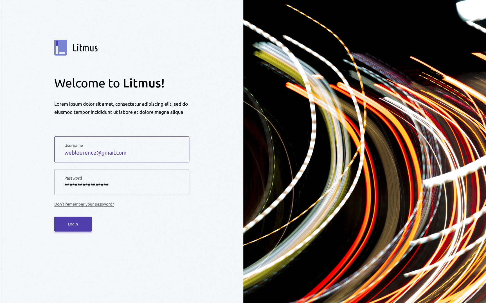
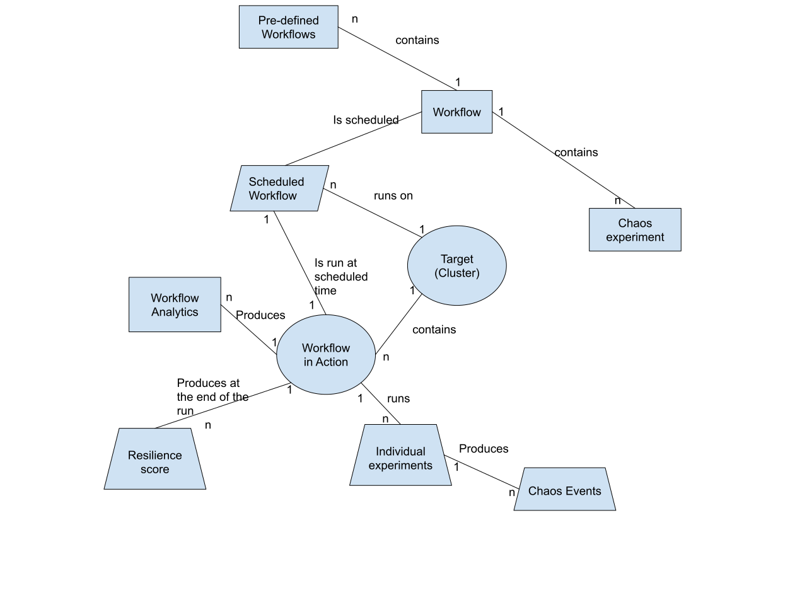
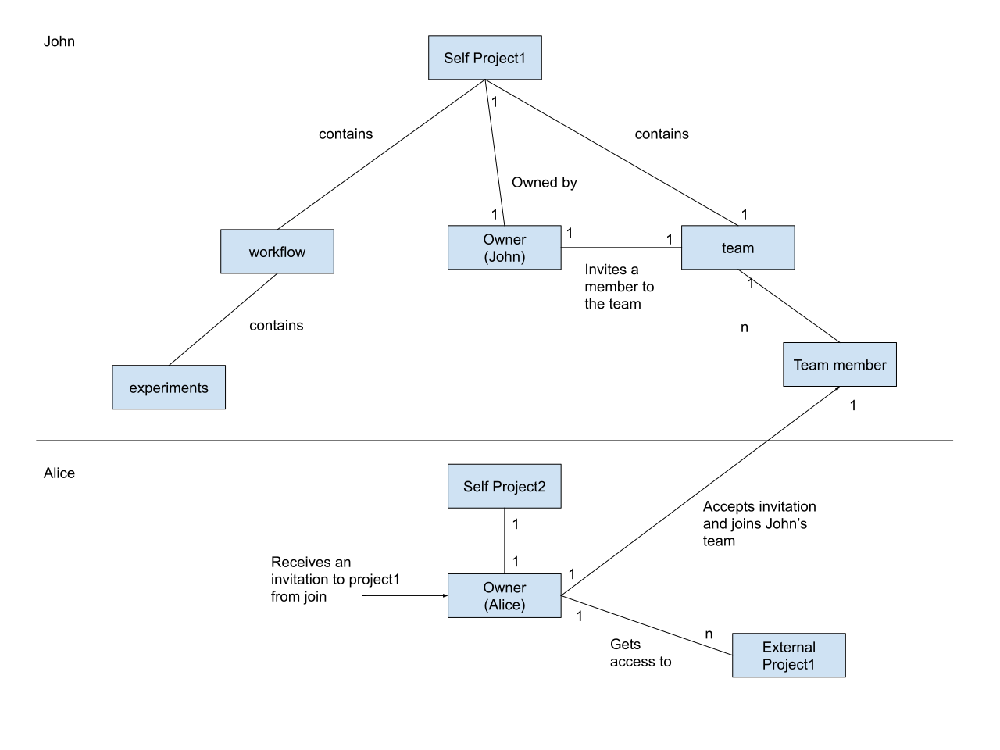

# Litmus Portal Design Specification

When users install Litmus through helm, Litmus-Portal also gets installed and ready to start. Apart from giving a simple get-started interface to new users, Litmus-Portal provides console or UI experience for managing, monitoring, and events around chaos workflows. Chaos workflows consist of a sequence of experiments run together to achieve the objective of introducing some kind of fault into an application or the Kubernetes platform.

**Login screen of Litmus Portal**

## User Personas

The following personas use Litmus Portal.

**Kubernetes SRE**

| **User type**  | Website User (External)                                      |
| -------------- | ------------------------------------------------------------ |
| **Occupation** | Site Reliability Engineer                                    |
| **Name**       | Richard Hills                                                |
| **Objective**  | Site Reliability Engineer or SRE is the Kubernetes administrator responsible for running the Kubernetes platform and the applications on the Kubernetes platform. An SRE needs to keep the reliability of the Kubernetes system high. To achieve this, SREs practice chaos engineering on production systems where they keep injecting faults to see if the services have fault tolerance.  SREs need to know how resilient their systems are or they want resilience scores of the system or the applications. SREs come to Repute to get resilience reports and scores of their systems. They come to Repute to practice chaos engineering in an easy way. Kubernetes SRE is the primary persona in Repute. They create or use reliability workflows. |

**Kubernetes Developer**

| **User type** | Website User (External)                                      |
| ------------- | ------------------------------------------------------------ |
| **Name**      | Alice                                                        |
| **Objective** | Application developers who are developing applications are called Kubernetes developers. Kubernetes developers practice chaos engineering in CI pipelines. CI pipelines run on ephemeral clusters where a Kubernetes cluster is brought up, applications are deployed, chaos tests are run and finally, the Kubernetes cluster is brought down. Developers need to know how the pipelines have been working against a particular failure over. They also need to know how to inject a failure.  Repute provides reliability analytics of CI pipelines to Developers. They come to Repute for two main reasons:For analytics of CI pipelinesFor creating chaos experiments and reliability workflows |
|               |                                                              |

## Relationship diagrams

**Litmus Objects**

Below diagram shows the relationships between various objects inside Litmus portal. This is useful in understanding UX design.

**Projects and teams**

Every user is associated with only one project. A user can be invited to someone else's project through an invitation. When a user receives an invitation, and the invitation is accepted, the invitee's project is visible in the receiver's portal.

## User Stories

User stories are to be used to design UX wireframes. Each user story represents a particular scenario or action that any one persona can do at one time.

### **User story - SRE installs Litmus on a Kubernetes cluster**

#### **Trigger**

SRE wants to practice chaos engineering using Litmus and proceeds to installation on the Kubernetes cluster

#### **Script**

1. I am an SRE, I want to practice chaos engineering on my Kubernetes platform and the applications running on Kubernetes cluster. My cluster has the required prerequisites to install Litmus (2GB memory and 1 vCPU). I choose to install Litmus via helm chart. I have chosen all defaults in values.yaml file such that I get litmus-portal also installed for me to manage and orchestrate chaos.
2. I install helm chart using the commandhelm install litmus/litmus.yamlI get a message or I find from the documentation that I need to browse “http://<nodeport-ip>:30890”.
3.  I browse http://<nodeport-ip>:30890. I get a username and password prompt. I read from the docs that default username is “admin” and the password is “litmus”. I login with these credentials.
4. I am prompted to change the password at the first login. And then I am greeted with the first time landing page

### User story - SRE schedules a chaos workflow

#### Trigger

As an SRE, I want to be able to login into Litmus Portal start scheduling chaos workflows so that I can start analyzing the reliability or resilience of my Kubernetes cluster or applications running on a Kubernetes cluster. I login and see an option to schedule a new workflow and choose it.

#### Script

1. As an SRE, I do a local login into litmus portal using the basic authentication credentials. As I am doing the login for the first time into Litmus portal, I have no chaos workflows scheduled to run, I will be greeted with all possible options such as 
   1. Start scheduling a new chaos workflow.
   2. Learn more about Litmus portal (a video link).
   3. I can also possibly invite my team members who are on this litmus portal.
   4. I should not see any alerts as I am coming here for the first time.
2. I click on “Schedule new workflow” button. Then I will be presented with options on which cluster I can schedule the workflow. I am allowed to choose the cluster on which Litmus portal is running or I can install litmus agents on a new cluster and then start scheduling the workflow.
3. I choose the default cluster as my target. 
4. Then I will be able to name my workflow and provide a brief description to the workflow I am about to schedule.
5. Then I will be presented with a list of pre-defined workflows that are available in the litmus portal.
6. I will select one of them and then try to tune the workflow. The workflow consists of a detailed YAML manifest. Tuning the workflow means changing some of the YAML code. I can read the manifest in detail and take out any experiments I do not want or change some parameters inside the YAML file. Once I am happy with the tunning of the YAML file will start tuning the resilience score of the workflow.
7. Resilience score = (SUM of weights of the passed experiments in the workflow / SUM of weights of all experiments in the workflow ) * 100 . I want to retune the weights of experiments relative to each other. I want to be able to see the possible reliability score when a given test fails or passes. 
8. After tuning the workflow, I want to now choose the options in scheduling. I will choose from one of the many options such as Schedule nowSchedule at a later specific timeSchedule at a random time etc.
9. I will finally schedule the workflow by clicking the final okay button.
10. The workflow is scheduled as per the chosen schedule. When the workflow is run, the experiments are run as per the sequence in the workflow. Results of the workflow are used to calculate the resilience score of the workflow. Many events are generated during the workflow run. All these are supposedly captured in litmus portal along with the results. 
11. When I click on the final screen button that says “workflow scheduled successfully”, I should be taken to a workflow home page. 

### User story - SRE browses the workflows homepage

#### Trigger

As an SRE, I want to browse the workflow page and understand what's going on so that I can take some meaningful call-to-actions. There are workflows scheduled already and I want to browse workflows homepage.

#### Script

1. I login into litmus-portal and am greeted with some alerts or important messages or calls to actions on the landing page. I choose to go to workflow page

   1. (Or) I am somewhere else on the Litmus portal and choose to go to the Workflow page
   2. (Or) I just finished scheduling a workflow and am taken directly to the workflow page

2. I want to get a comprehensive list of actions that I can take and give enough information to me about whats going on. This is one of the most important screens to me on Litmus portal

3. Information I want to see

   1. Top level analytics of workflows
      1. Number of total workflows
      2. Passed vs failed
      3. Current average resilience score
      4. Lowest resilience score in the recent run
      5. Highest resilience score in the recent run
      6. A time series graph of over all resilience score over a period of last three months
   2. List of workflows that are scheduled 
   3. Latest workflows in action
   4. List of chaos events
   5. List of top failures
   6. Most recent actions taken by me
   7. Actions I can take
   8. I want to be able to filter the workflows based on some criteria such as
      1. Target cluster
      2. Name of the workflow
      3. Created in last 7 days
   9. For example, I want to be able to know the workflows scheduled on a given cluster or workflows scheduled on a set of clusters or workflows scheduled on all clusters in a given period of time or just give me all matching workflows based on some word search
   10. I can go and start scheduling a new workflow
   11. I can go see more details of a given workflow that I select after filtering
   12. I can edit a scheduled workflow
   13. I can stop a scheduled workflow (or halt it as some may call it)
   14. I can delete a scheduled workflow

4. One of the most important information is the available pre-defined workflows for me. I want to be able to browse and understand what they are. If I can see them in a separate tab on this page (very much visible to the eye), that will be helpful. I might even want to see them as the first thing on the page.

5. I want to be able to see workflows in action(WIA). I should be able to filter out these WIA based on the same criteria that I have for selection of scheduled workflows (SW). After selecting a given workflow in action, I can go into more details of the workflow and see the results or status of each experiment within the workflow and get events, logs etc

   

### User story - **SRE connects a new target or cluster to Litmus Portal**

#### Trigger

SRE chooses to add a new target where chaos workflows need to be scheduled. This can be triggered either at the time of scheduling a new workflow or from the workflows home page.

#### Script

1. I login into the portal and see an option to connect a new target

   1. I also see a similar option while selecting a target during the scheduling of a workflow

2. I choose the option to “connect a new target”. I will be presented with a command line and instructions to execute the same on the target cluster. 

3. I copy the command into the clipboard and go to my Kubernetes console or shell and execute the command. It will be something like 

   1. kubectl apply - f http://10.23.1.21:30949/newconnect?cmd=lsfj03rklsklsrj3r3lkasf0alkdfjnlsjf0wew5lwwrwa

4. Once I execute this command, the connection from the cluster to Litmus portal starts to get established. If everything goes fine, the connection gets established in anywhere from 1 minutes to 3 minutes. During this time, if the browser is kept open on the same screen of copying the command, and the connection gets established the target gets connected to the portal. Then I will be taken to “schedule a new workflow on this target screen”

5. I also should see a tab called “Targets” in the workflows screen. I can go to targets and manage this targets. For example - I can find the status of the target (connected/disconnected), status of the agents inside the target, disconnect the target, troubleshoot the litmus agents on the target or upgrade the litmus agents on the target etc. I can also see an option to connect a new target in the “Targets tab”.

   

### User story - **SRE edits a scheduled workflow**

#### Trigger

SRE wants to edit an existing “scheduled workflow”.

#### Script

1. I login into LitmusPortal and go to the workflows section
2. On the workflows page, I see a tab “Scheduled workflows” 
3. I go to that tab and apply the required filters and select the workflow that I want to edit
4. I see an edit option and choose that option
5. I will be taken through the wizard similar to the scheduling of  a new workflow. The information will be pre-populated in each section of the wizard.  
6. At the end of the wizard the schedule is edited. I am also asked if these changes are to be applied to the ongoing schedule if applicable (if a workflow-in-action for this schedule is present).
7. A schedule details can have the information of the changes made to the schedule by whom and when (audit events)

### User story - **SRE monitors a workflow in action**

#### Trigger

SRE wants to see whats going on with a workflow either voluntarily or after seeing/receiving an alert.

#### Script

1. I login into LitmusPortal and I see most recent workflows-in-actions on the landing page.
2. If there are more workflows-in-action, I can apply the filter and select a workflow-in-action that I am interested in
3. I want to status of a workflow that I generally see with Argo workflow. https://user-images.githubusercontent.com/12677113/44878353-82b98d80-ac5b-11e8-8ac9-10da35ffbaaa.png
4. When I click on a given workflow, I am taken into the details of the given workflow like how argo workflow takes me. https://twitter.com/kelseyhightower/status/984035805025972224/photo/1 
5. The workflow-in-action has a status that can be either ongoing or completed. The filter can also a field to indicate if I want to browse the workflows ongoing or completed.

## Non Functional Requirements

**The frontend stack of the website must include**

- React
- Typescript
- Material UI

**The backend stack of the website must include**

- GraphQL with a lightweight database to store the data.
- Authentication service with a lightweight database to store the users data
- Optional Prometheus server

**For visualization and analytics**

- Plotly

**Compatibility**

- The portal must be compatible with all modern browsers

**Performance and scalability**

- The portal should be scalable enough to manage hundreds of chaos workflows at a time with hundreds of users simultaneously logged in. The landing page must provide 2 seconds or less response time in all modern browsers including the rendering of texts and images.

**Availability**

- The portal must be available more than 98% of the time.

## Glossary

**Project**

A project is a working area of a person who signed up at Repute. Every signed up user is assigned a new project at the beginning. A user cannot have more than one project but can be invited to the projects of other users. 

**Team**

A user by default is the owner of his/her team which is created at the time of signup. A user can invite other users on repute into the team. Once the invited user accepts the invitation, the inviter’s project will be visible in invitee’s dashboard.
The concept of team is used to share their project with others and collaborate experiments, workflows with others.

**Cluster**

A set of servers is called - a Kubernetes cluster. In this document, or on Repute, cluster means a Kubernetes cluster.

**Chaos Experiments**

A test used by an SRE or developer to check the reliability of a Kubernetes platform or an application running on Kubernetes platform. On Repute, we call them experiments. Experiments that are generic and publicly shared are posted at chaos hub available at [https://hub.litmuschaos.io](https://hub.litmuschaos.io/). Developers or SREs use these experiments from the public hub or they can develop new ones and submit them into the private chaos hubs managed at Repute. Chaos experiments are used to create resilience workflows.

**Resilience Workflows**

A resilience workflow is a set of chaos experiments run in a specific sequence. 

**Chaos Hub**

Chaos Hub is a place where all experiments are stored together. There is a public chaos hub at [https://hub.litmuschaos.io](https://hub.litmuschaos.io/) . Developers or SREs can use the experiments from the public hub or they can clone it into their GitHub repository and make a private chaos hub out of it. Repute supports creation or cloning of chaos hubs and developing experiments in them.

**Resilience score**

It is a result of the execution of a resilience workflow. Each experiment in a workflow will have a certain weight (example 6 out of 10). When an experiment is passed, its weight is carried towards the passed weight of a workflow. 
Resilience score of a workflow = (sum of weights of all passed experiments/sum all weights of all experiments)*100
If all experiments in a workflow pass, then the resilience score = 100

**Namespace**
It is a logical area in which applications run inside a Kubernetes cluster. One or more applications can run in a namespace.

**Application**
An application running inside a namespace of a Kubernetes cluster.